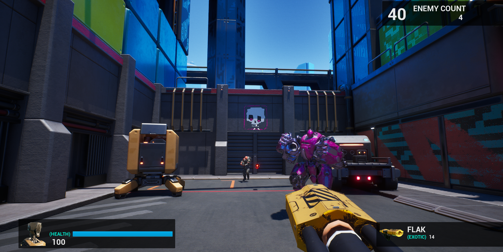
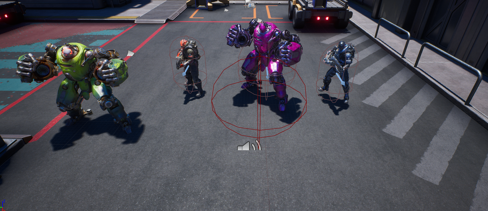
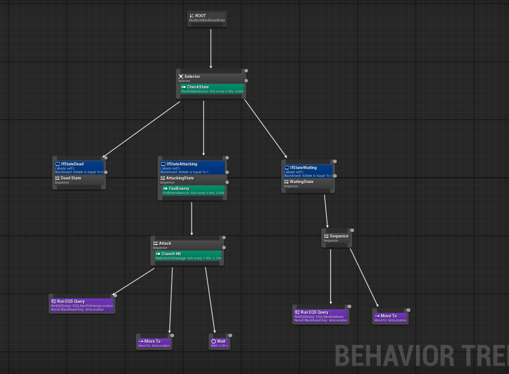
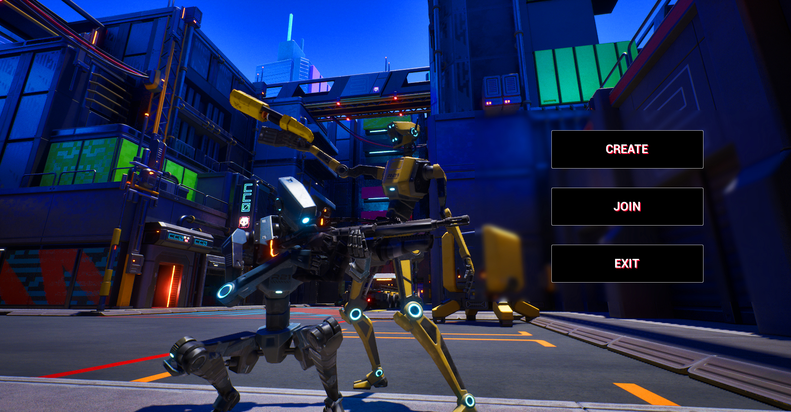
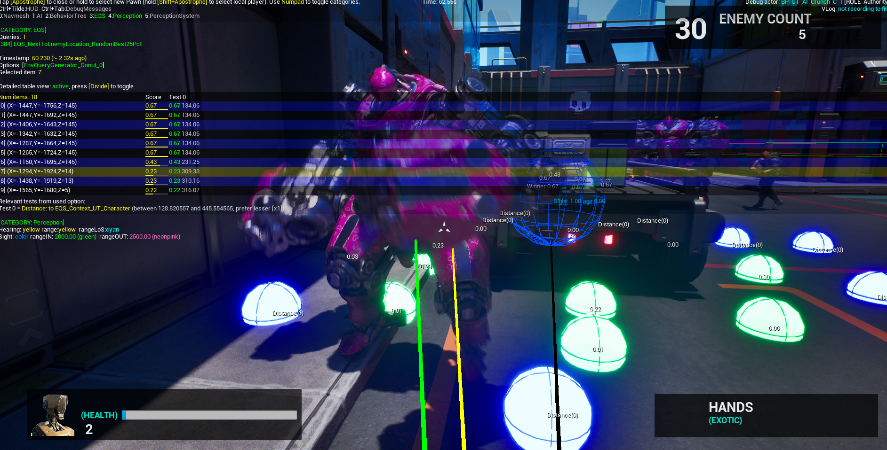

# UE Multiplayer AI Shooter

**Demo video:** [https://www.youtube.com/watch?v=c6r5oxIIQtU](https://www.youtube.com/watch?v=c6r5oxIIQtU)

> This repository contains the project and notes for my Unreal Engine multiplayer AI shooter. Below you’ll find a high-level overview of the gameplay mechanics, AI patterns, networking patterns, build & run notes, and where to look in the project for each system.

---

## Quick summary

A multiplayer shooter built in Unreal Engine featuring server-authoritative gameplay, replication of player and AI state, and an extensible weapon system. AI are driven by Behavior Trees, Perception (AI Perception / Sight), and a combination of tactical behaviors (patrol, seek cover, flank, suppress). The project demonstrates practical networking patterns (server RPCs, multicast, client prediction & smoothing) and common game architecture patterns (component-based weapons, data-driven configs, factories/pools).



---

## Table of contents

1. Features & mechanics
2. AI systems & patterns
3. Gameplay systems & patterns
4. Networking / replication patterns
5. How the project is organized (where to look)
6. Build & run
7. Tuning & data-driven assets
8. Known limitations & optimization notes
9. Contributing / Contact / License

---

## 1. Features & mechanics (what you asked to see)

These are the visible mechanics in the demo video and the repository. If you used variations, replace entries below with your exact names/files.

* **Player movement**

  * Walk / run / crouch, sprint, jump
  * Movement replication using `CharacterMovementComponent` with smoothing and client-side prediction
* **Weapon system**

  * Multiple weapon types (hitscan rifles, projectile grenades, burst/auto fire)
  * Weapon equip / swap / pickup
  * Fire modes, recoil, spread and aim offsets
  * Ammo, reload, and magazine management
  * Weapon objects implemented as components or actors (Factory pattern for spawning)
* **Shooting & damage**

  * Server-authoritative hit processing for security
  * For hitscan: client traces for visual feedback, server re-trace for authoritative hit registration
  * Damage application with damage types and modular health component
* **Health & death**

  * Health component, damage handling, ragdoll or death animation
  * Respawn controller with spawn points and spawn protection
* **Cover & tactical behavior (AI & players)**


  * Cover detection (navmesh based or custom traces) and cover selection
  * Suppression mechanics (optional) and reduced accuracy under fire
* **Aiming & target selection**

  * Aim offset / look-at blend animation
  * Target prioritization for AI (closest/visible/most dangerous)
* **Player HUD & UI**


  * HUD showing health, ammo, kill feed, minimap / radar (optional)
* **Match flow**

  * Lobby / match start, round timer, score tracking, team assignment
* **Pickups & items**

  * Health packs, ammo, powerups with respawn timers
* **Projectiles & physics**

  * Grenades / rockets with explosion damage and radial impulses
* **Analytics / debug tools**

  * Simple logging, in-editor debug draw for perception and nav decisions

---

## 2. AI systems & patterns (detailed)

This project uses a layered AI architecture combining Unreal's tools and classic AI patterns:



* **Perception system**

  * `AIPerceptionComponent` with sight and hearing senses.
  * Stimuli are registered and routed to Behavior Trees via the AI Controller.
* **Behavior Tree + Blackboard**

  * High-level behavior is encoded in a Behavior Tree.
  * Blackboard keys for `TargetActor`, `LastKnownLocation`, `CurrentCover`, `IsSuppressed`, etc.
* **State & Finite State Machine (FSM)**

  * Nodes correspond to states: `Patrol`, `Alert`, `Engage`, `SeekCover`, `Flank`, `Fallback`.
  * The Behavior Tree orchestrates state transitions, with service tasks updating blackboard keys.
* **Tactical sub-behaviors**

  * **Patrol**: Move along waypoints using navmesh. Uses move requests with acceptance radius.
  * **Investigate**: Go to last stimulus location for a limited time.
  * **Engage**: Seek line-of-sight and fire. If suppressed or low health, transition to `SeekCover`.
  * **SeekCover**: Evaluate nearby covers (cover points) — uses a scoring function (distance, angle, exposure) to pick the best.
  * **Flank**: If teammate is engaging, attempt an alternate approach vector using temporary goals.
* **Utility & scoring**

  * Simple utility score or weighted heuristics choose actions (e.g., prefer cover if health < 40%).
* **Sensing + prediction**

  * Predict player movement for leading shots (basic linear extrapolation) and prefer high-probability shots.
* **Group coordination**

  * Simple team awareness via blackboard / shared data (e.g., last-known enemy position) and role assignment (suppressive vs flanker).
* **Navigation**

  * Uses Unreal NavMesh with dynamic nav modifiers for destructible or blocked areas.

Where to find: `AI/Controllers/*`, `AI/BT/*`, `AI/Blackboard/*`, `AI/Tasks/*`.

---

## 3. Gameplay systems & architecture patterns

* **Component-based design**

  * Reusable components for Health, Inventory, WeaponComponent, Damageable, and NetworkReplication helpers.
* **Factory / Spawner pattern**

  * Weapon and pickup spawning handled by a factory/spawner class (data-driven spawn tables).
* **Object Pooling**

  * Pools for frequently spawned objects (projectile pooled actors) to reduce allocations.
* **Event-driven / Delegates**

  * Use `DECLARE_DYNAMIC_MULTICAST_DELEGATE` for events like `OnHealthChanged`, `OnWeaponFired`, `OnPlayerKilled`.
* **Singleton-like systems**

  * `GameMode`, `GameState`, `PlayerState`, and `GameInstance` for global match state and rules.
* **Data-driven config**

  * Use `DataTables` / `Structs` for weapon stats, AI parameters, spawn rules so tuning doesn't require code changes.
* **Separation of client visuals from server logic**

  * Clients perform cosmetic effects (muzzle flash, bullet tracers), while the server authoritatively applies gameplay effects.

---

## 4. Networking & replication patterns

Key patterns used to make multiplayer feel responsive while remaining secure:

* **Server-authoritative model**

  * Server validates and applies critical gameplay events (damage, spawn, ammo updates).
* **Movement replication**

  * Leverage `CharacterMovementComponent` built-in prediction and reconciliation. Implement smoothing for remote actors.
* **RPC types**

  * `Server` RPCs: client -> server requests (e.g., `ServerFireRequest()`), validated when necessary.
  * `Multicast` RPCs: server -> all clients for cosmetic broadcast (e.g., play firing VFX).
  * `Client` RPCs: server -> single client (use sparingly).
* **Client-side hit effects + server verification**

  * Client may show immediate hit effects, but the server performs the final trace to determine damage.
* **Replication strategy**

  * Use `RepNotify` for important state changes, and selective replication (only relevant actors replicated to nearby clients using relevancy settings).
* **Prediction & reconciliation for firing**

  * Predictive firing helps feel responsive (visuals and local traces), but authority remains on server.
* **Optimization**

  * Avoid large replicated arrays; use RPCs or server-owned state; frequency-limit movement updates and expensive replication.
* **Security**

  * Validate ammo counts, fire rate, and input timestamps on server side to reduce cheating surface.

Files: `Network/*`, look for `Server` prefixed functions, `NetMulticast` or `Client` tags.

---

## 5. How the project is organized (where to look)

(Adjust paths to match your repo structure)

* `Source/YourGame/` - C++ gameplay code

  * `Characters/` - Player and AI character classes
  * `Controllers/` - PlayerController, AIController
  * `Weapons/` - Weapon base and implementations
  * `AI/` - Behavior trees, tasks, services in C++ and BP wrappers
  * `Components/` - HealthComponent, InventoryComponent, etc.
* `Content/` - Blueprints, animations, Behavior Trees

  * `Blueprints/Characters/` - BP characters
  * `Blueprints/Weapons/` - BP weapons and pickups
  * `AI/BT/` - Behavior trees and blackboards
  * `UI/` - HUD, widgets
* `Config/` - DefaultGame.ini and network-related settings

---

## 6. Build & run

```bash
# clone
git clone https://github.com/GholemHub/UT2_Game


# If C++ project: generate project files (Windows example)
/path/to/UnrealEngine/Engine/Build/BatchFiles/RunUAT.sh BuildPlugin -Plugin="MyPlugin.uplugin" -TargetPlatforms=Win64
# or use the editor to open the .uproject and let it compile

```

Local host testing:

* Use `Play > New Editor Window (PIE)` with number of players set to >1 or run dedicated server + client from command line.

---

## 7. Tuning & data-driven assets

Place tunable values in `DataTables` (CSV/JSON import), e.g.:

* Weapon damage, fire rates, recoil curves
* AI aggression thresholds and perception ranges
* Spawn timers and pickup respawn rates

Recommended workflow: change values in DataTable → run quick PIE with two players → observe logs and tweak.

---

## 8. Known limitations & optimization notes

* Client-side cosmetic effects can drift slightly from server state; ensure important gameplay is validated server-side.
* Large numbers of AI will stress the server — consider LOD for AI (stop ticking non-critical AI far away).
* Track replication bandwidth in profiler and reduce replicated state frequency where possible.

---

## 9. Contributing / Contact / Credits

If others will use this repo, include these:

* **How to contribute**: Fork → feature branch → PR. Follow code style and include changelog entry.
* **Contact**: Add your Discord / Email / Github handle.
* **Credits**: Third-party assets, engine versions, plugins you used.

---

## License

Add your preferred license (MIT / GPL / proprietary). Example placeholder:

`MIT — see LICENSE file`.

---
